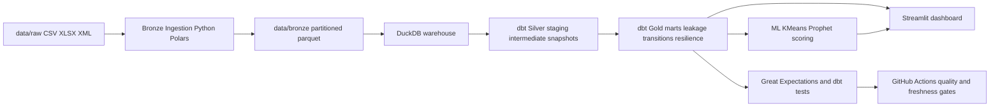

# Phase 01 Architecture V1

## Architecture summary
The solution follows a medallion design:
- Bronze: resilient ingestion and normalization from raw files
- Silver: harmonized conformed entities with dbt
- Gold: leakage and transition marts for policy analytics

## Data flow v1 (logical)

## Control points
- Raw lock file: `data/raw/RAW_STATE_LOCK.csv`
- Incremental ingest control: `metadata_manifest.json` (Phase 04 implementation)
- Freshness check key: latest `Stichtag`
- Key harmonization rule: AGS normalized to 5 digits

## Review notes
- Stage 5 uses flat CSV as canonical with XML parity ingestion.
- Fallback source files are retained for reconciliation, not aggregation.
